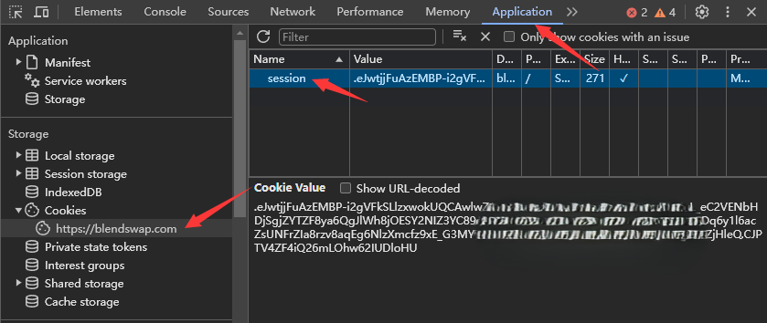
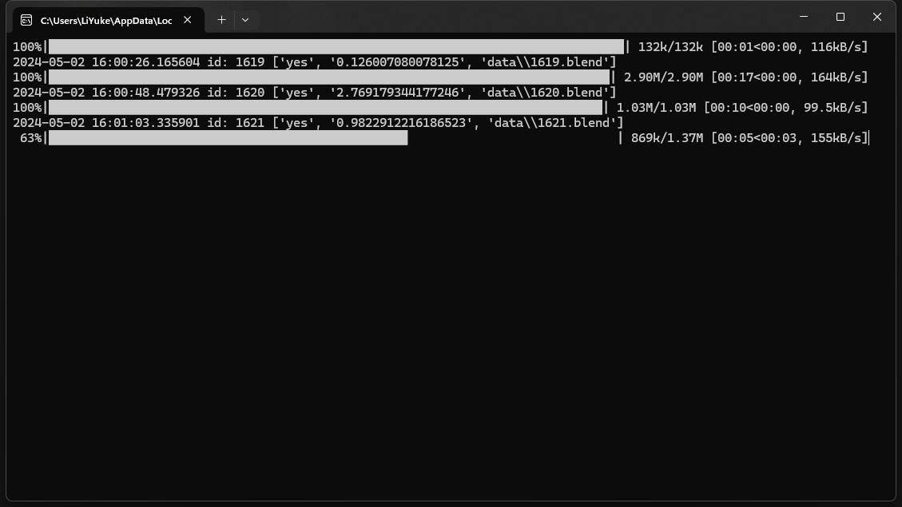

# BlendSwap Downloader

a crawler of blendswap

Automatically download models from the [blendswap](https://blendswap.com/) website.

Using selenium Webdriver to obtain `data.csv`，which contains information such as page, ID, title, cc, download count, likes count, etc. As of May 1, 2024, there are 25196 entries of information.

This information was stored in `data.csv`

# main.py

You can skip this paragraph, cause the `data.csv` of 25196 entries of information is already in the file list.

Script for constructing `data.csv` based on selenium.

After import packages, you can change: 

```python
start_page = 0 # Starting page for crawling
end_page = 1400 # Ending page for crawling
wait_time_after_load_page = 3 # Waiting time after loading a new page
username = ''
password = ''
```


# downloader.py

Read data from `data.csv` and download.

How to get cookie?

Open blendswap in your browser and log in to your account. Press F12, choose application-Cookie-https://blendswap.com, copy the `Cookie Value` of the `session` key, Paste into `cookie.txt` and save.



After import packages, you can change: 

```python
max_file_size = 99999  # Maximum file size in MB for downloading
min_file_size = 0  # Minimum file size in MB for downloading
csv_file_path = 'data.csv'
start_line = 0  # Starting line in the CSV file
download_path = 'data\\'
base_url = 'https://blendswap.com/blend/{}/download'
```

If your cookie is invalid or your account's daily download limit has been exhausted, this message will be prompted: Download quota used up... or cookie invalid...

Creating an account in Blendswap does not require verification. So ou can easily create accounts. Or you can subscribe it, then you can download without restrictions.



running...

