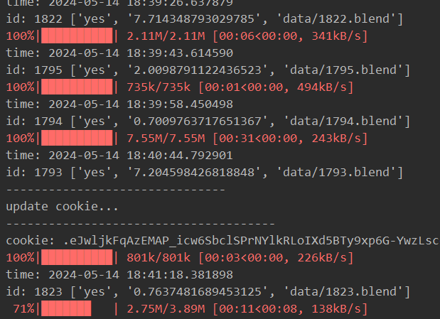
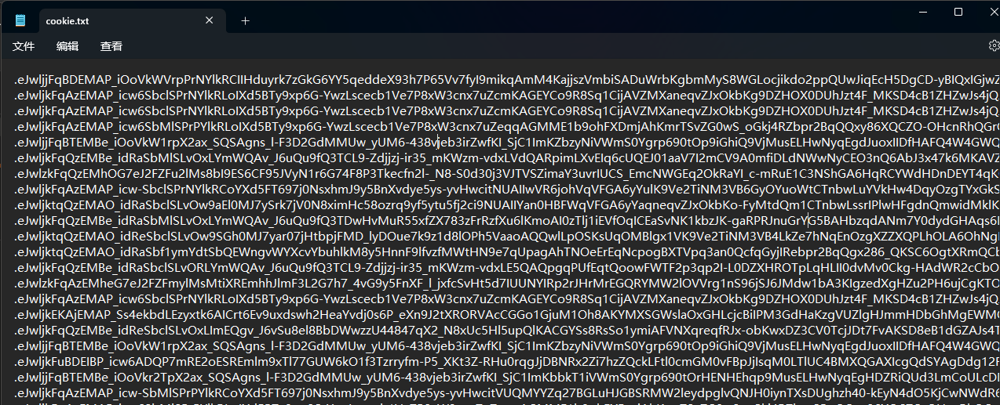

# BlendSwap Downloader

blendswap的爬虫。

自动从[blendswap](https://blendswap.com/)网站下载模型。

使用selenium Webdriver获取`data.csv`，其中包含页面、ID、标题、下载次数、点赞次数等信息。截至2024年5月1日，共有25196条信息。

此信息存储在`data.csv`中。

# downloader.py

从`data.csv`中读取数据并下载`xxx.blend`。

导入包后，您可以更改：

```python
max_file_size = 99999  # Maximum file size in MB for downloading
min_file_size = 0  # Minimum file size in MB for downloading
csv_file_path = 'data.csv'
start_line = 0  # Starting line in the CSV file
download_path = 'data/'
base_url = 'https://blendswap.com/blend/{}/download'
```

首先运行`getCookie.py`，注册账号、生成一定数量的cookie，并记录在`cookie.txt`。



正在运行...

如果您的cookie无效或您的帐户的每日下载限制已用完，将提示此消息：Download quota used up... or cookie invalid...

在Blendswap中创建帐户不需要验证。因此，您可以轻松创建帐户，脚本已经包含了自动注册的流程，因此你可以直接使用它，但是创建账号的过程需要一些时间。或者你可以订阅它，然后你可以无限制地下载。

# Blend->NerfDataset

Blender首先要安装插件：[BlenderNeRF](https://github.com/maximeraafat/BlenderNeRF)

运行`blend2NeRFdataset.py`根据`data.csv`，自动调用blender并启用上述插件进行渲染，进行`.blend`文件到Nerfdataset的转化。

`blend-script`是blender执行的脚本，可以在里面设置调整一些参数，如渲染引擎，尺寸，相机半径等信息。

我现在还没有解决相机半径的问题，**如何利用blender中一些物体的信息，计算合适的相机半径？**这对于生成符合要求的nerf数据集非常关键。

# getCSV.py

您可以跳过这一段，因为25196条信息的`data.csv`已在文件列表中。

基于selenium构建`data.csv`的脚本。

导入包后，您可以更改：

```python
start_page = 0 # Starting page for crawling
end_page = 1400 # Ending page for crawling
wait_time_after_load_page = 3 # Waiting time after loading a new page
username = ''
password = ''
```

# getCookie.py

包含一个`CookieMaker`类，调用`CookieMaker.getCookie`方法会自动注册并获取cookie，main方法是生成一定数量的cookie并保存到文件中。



每行存放一条cookie


# Use you own cookie

如何获取cookie？

在浏览器中打开blendswap并登录到您的帐户。按F12，选择应用程序Cookie-https://blendswap.com，复制“session”键的“Cookie Value”，粘贴到“Cookie.txt”中并保存。如果你要使用自定的cookie需要对`downloader.py`进行一些改动，或者直接退回上一个版本。

